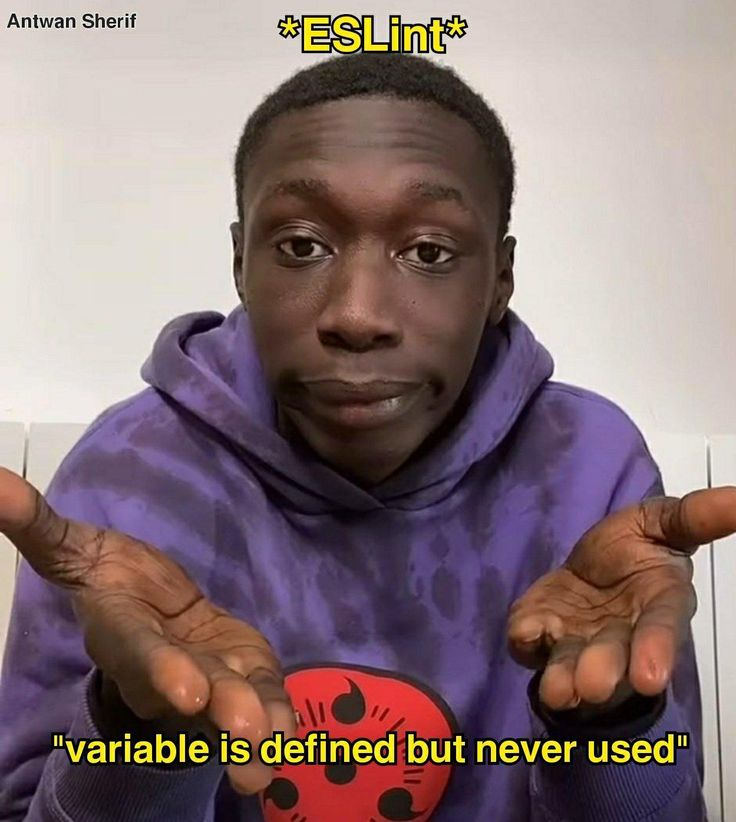

### Initial Thoughts
Coding standards are a set of rules that developers follow to keep their code readable and consistent across the entire team. This is especially important when working with others, not only in professional projects but also in group assignments. Having a consistent and reliable "format," so to speak, for how code is written reduces confusion when reviewing other people’s work. Less time is spent being distracted by style, and more time is spent analyzing and understanding the code itself.

In this class, and very likely in the real world, coding standards are enforced using software tools called linters. Linters are code analysis tools that can be run on your code to check whether it adheres to the configured standards for the project. They are, so to speak, figurative men watching over your shoulder and judging your code.Developers collectively recognized the importance of coding standards and created linters to enforce and maintain them. Setting up and configuring a linter takes more upfront effort, but the time saved by catching common bugs and encouraging good practices makes it worthwhile in the long run.

For this class, we use ESLint with the Airbnb JavaScript coding standard. It includes what I like to call "aesthetic" rules, such as disallowing trailing spaces, requiring only one newline between lines of code, and enforcing a newline at the end of the file. It also enforces rules that prevent common JavaScript pitfalls, such as requiring `let` or `const` instead of `var`. One thing that frustrates me about this setup is the “red squiggly line of death” that appears when something minor is out of place while I’m still writing code. It’s distracting when I add extra newlines to give myself some visual space to think and immediately see a big error warning. That’s probably just a personal preference I’ll have to get used to. Fixing ESLint errors does help me learn the language to some extent, though mostly through pattern recognition and avoiding the same mistakes in the future.

### Future Use
Now that I’ve been exposed to good software development practices such as using linters in both ECE 205 and ICS 314, I’m beginning to wonder how I might apply them to my VIP project. For example, could I not only enforce coding standards within individual files but also check the structure of the entire project? In the past, I’ve run into issues where everyone on the team structured their codebase differently while working on separate branches. Once we merged to main, the source code files ended up in different places. We could write up a file structure guideline, but having a system that automatically flags violations in a clear and immediate way would be much more effective.

Grammar and proof reading done with ChatGPT