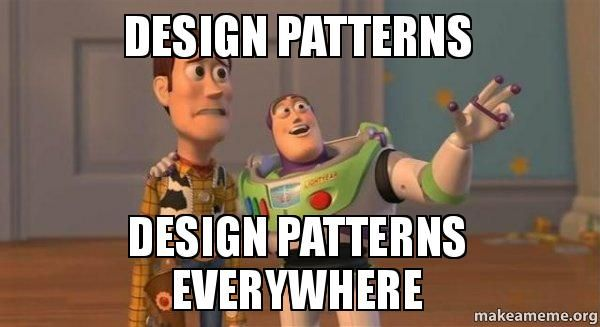

### Agile Project Management
Agile project management is a software development style that is based on short development cycles and continous feedback. The version of this that we used in this class was called Issue Driven Project Management for the final project. This type of project management is where issues/tasks are assigned to indivuals and should take up to 72 hours to complete. The idea was that you iterate and always know what to do. We kept track of everything in GitHub project boards for our final project and meet in class twice a week. 

I enjoyed this method of project management. Espcially with it being hosted on GitHub allows for development to all be in the same place. I can definitely see myself using this for another project where I work with others. GitHub project boards would allow everyone to be on the same page of what needs to be done and who is doing what. I also enjoyed doing small changes in branches and merging to main immediately when the issue is closed. In the past, big tasks were worked on in seperate branches and would diverge from each other. This caused many merge conflicts and headaches when merging to main. Issue Driven Project Management would solve this problem.

### Coding Standards
Coding standards are essential in software engineering because they ensure consistency, readability, and maintainability across a team’s codebase. When everyone follows the same conventions, it becomes much easier to review and understand each other’s work without getting distracted by stylistic differences. In ICS 314, we enforced these standards using ESLint with the Airbnb JavaScript style guide. The linter caught formatting issues, stylistic inconsistencies, and common JavaScript pitfalls, which helped reinforce good habits. Although the constant error warnings sometimes felt interruptive—especially while still typing—it ultimately helped me internalize the rules and write cleaner, more consistent code.

Using linting tools in both ECE 205 and ICS 314 has made me appreciate how much they support collaboration and reduce technical debt. They prevent small mistakes from snowballing into larger problems and help teams maintain a shared understanding of code quality. As I move forward into larger projects, such as my VIP work, I can see the value of enforcing not only file-level standards but also consistent project structure. Past experiences with disorganized branches and mismatched file layouts showed how quickly a project can become chaotic without guidance. Automated standards and linting tools can help avoid those issues and keep a codebase maintainable as it grows.

---
layout: essay
type: essay
title: "Lost in Manoa"
# All dates must be YYYY-MM-DD format!
date: 2025-12-01
published: true
labels:
  - Design Patterns
---

## Understanding Design Patterns
Working on Manoa-Guesser felt similar to navigating the UH Mānoa campus: there are many possible routes, but only a few pathways that consistently get you where you want to go without confusion. In software, those reliable pathways are known as design patterns—reusable architectural solutions that developers return to because they simplify complexity. They are not strict instructions but conceptual shortcuts that help teams communicate, organize code, and avoid reinventing solutions that already have well-established forms.

## Applications in Manoa Guesser
As our project grew from a handful of pages into a full web application with authentication, database access, asynchronous UI updates, and a game loop, I started seeing these patterns naturally emerge. Our use of NextAuth acts like a Factory pattern, where the credentials provider encapsulates the complex process of validating users and producing a session object. The rest of the system does not need to know how authentication works internally; it simply requests the “product” and receives a clean, standardized result.

The core gameplay logic also demonstrates the Strategy pattern. Our scoring and distance-calculation functions can change without requiring modifications to the components that call them. Whether we award points based on accuracy, time, or a custom formula, the React pages simply use whichever strategy function is currently defined. This allows us to evolve game mechanics without restructuring the UI or data flow. At the same time, React itself follows an Observer-like pattern: components automatically update when state changes, allowing the map, timer, score, and UI elements to respond to user actions without manual coordination.

On the backend, Prisma behaves as a Singleton by maintaining a single, shared database client instance across requests. This prevents unnecessary reconnections in development and ensures consistent communication with the database when deployed. Altogether, these patterns show that design patterns are not abstract academic constructs—they quietly guided the structure of Manoa-Guesser. By relying on patterns like Factory, Strategy, Observer, and Singleton, our final project became more predictable, maintainable, and scalable, illustrating the value of design patterns in real-world software engineering.

Grammar and proof reading done with ChatGPT